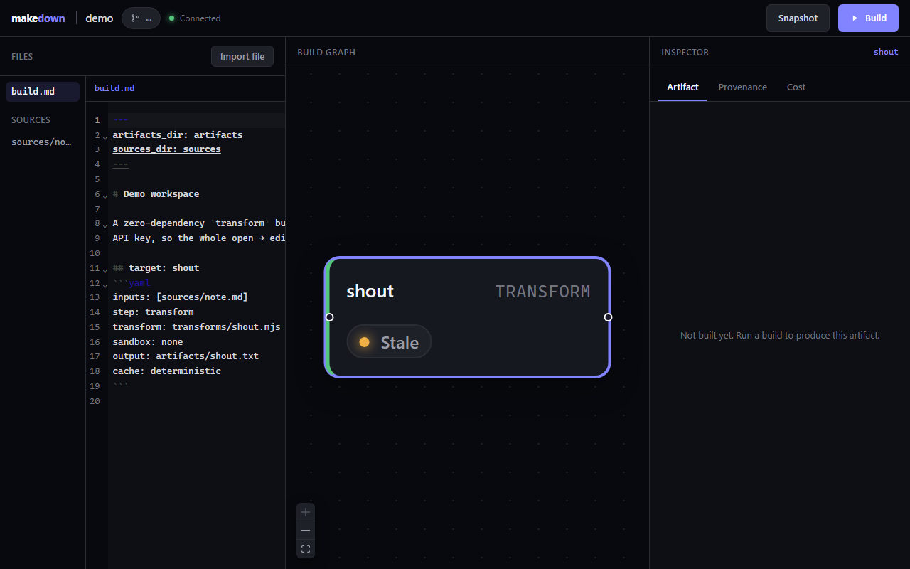

# Makedown

> **Make for LLM workflows.** A collaborative Markdown workspace where every
> inference and agent run is a content-addressed, incrementally-rebuilt,
> shareable **build artifact** — *"GNU Autotools × Notion."*

[](./LICENSE)
[](./LICENSING.md)
[](./CHANGELOG.md)
[](#requirements)

Makedown treats a directory of Markdown sources plus a `build.md` spec as a
**dependency graph**, and only recomputes what changed. Edit one source and just
the affected targets rebuild; a no-op rebuild costs **zero tokens**. Every
artifact carries full provenance (inputs, prompt, model, params, cost, tokens),
so a run is reproducible and auditable — not a chat you can't reconstruct.



## Why Makedown?

Other tools are prompt registries, flow canvases, or agent control planes. **None
has the `make` layer**: a declarative, content-addressed, incrementally recomputed
dependency graph where LLM/agent outputs are reproducible, provenance-tracked
artifacts. Concretely, Makedown gives you:

- **Incremental, content-addressed builds** — change a source, rebuild only what
  depends on it; identical inputs are served from cache, never re-run.
- **Cost before you spend** — `md cost` estimates the token/$ upper bound from the
  rendered prompts, with no model calls.
- **Many step types** — `chat`, `eval`, `map`, deterministic `transform` (zero
  tokens), and `agent` (a coding agent behind an approval gate).
- **Provider fallback + cost-aware routing** — survive a transient provider
  failure by walking a declared fallback chain; provenance records which model
  actually answered.
- **Import anything** — convert PDF/DOCX/PPTX/XLSX/HTML/EPUB/images to Markdown
  sources, or reference a binary directly and have it auto-imported on build.
- **Collaborate + share** — a real-time web workbench (CRDT co-editing, live DAG,
  inspector) and one-command shareable, read-only artifact exports.

## Quickstart (CLI)

The CLI runs `build.md` graphs fully locally — no server, no database, Apache-2.0.

```bash
npm install -g @makedown/cli        # installs the `md` command
md init my-workspace                 # scaffold a build.md + sources/
cd my-workspace
md status                            # what's stale and why
md cost                              # token/$ estimate — no model calls
export ANTHROPIC_API_KEY=sk-ant-...  # a key for the model steps (Windows: $env:ANTHROPIC_API_KEY)
md build                             # incremental build — only stale targets recompute
md why summary                       # full provenance for a target
```

No key yet? You can still run the whole **planning + deterministic** slice
(`status` / `graph` / `cost` / `why`, and `transform` builds) at zero cost. Try the
guided demo against the bundled flagship example:

```bash
node scripts/demo.mjs                 # narrated walkthrough of examples/showcase
```

> Until the first npm release is published you can run from source instead —
> see [Install](#install).

## How it works

A `build.md` is a literate Makefile: front-matter defaults, then `## target:`
blocks. Each target declares its `inputs`, a `step`, an `output`, and a prompt.

````markdown
---
defaults:
  model: anthropic:claude-opus-4-8
  params: { temperature: 0, seed: 7 }
artifacts_dir: artifacts
---

## target: brief
```yaml
inputs: [sources/quarterly-report.pdf]   # ← auto-imported to Markdown on build
step: chat
output: artifacts/brief.md
cache: deterministic
```
Summarize {{sources/quarterly-report.pdf}} for a busy CEO in three sentences.
````

| `step` | What it does | Tokens |
|---|---|---|
| `chat` | One model inference with the rendered prompt. | yes |
| `eval` | Score/grade an input; with a `schema`, the output must be valid JSON. | yes |
| `map` | Fan a prompt out `over` a list (`{{item}}` per element), collected into one JSON array. | per item |
| `transform` | Run a deterministic workspace script — *"code where code is enough."* | **zero** |
| `agent` | Coding agent (`agent:`) in an isolated `sandbox`, behind an approval gate. | yes |

The `cache` policy is per target: `deterministic` (cached by identity hash),
`stochastic(n=k)` (store k samples, surface variance, consume a "blessed" one), or
`always` (never cached; the default for `agent`).

Models are chosen per target as `provider:model` (e.g. `anthropic:claude-opus-4-8`,
`openai:gpt-5`), with keys/base-URLs from a workspace `.env` — so one workspace can
compare models across providers. A target can declare a **`fallback`** chain
(optionally `route: cost-aware`) to survive a transient provider failure; the model
that actually produced each artifact is recorded in provenance. See
[`SPEC.md`](./SPEC.md) for the full format.

The `md` commands:

```bash
md build            # incremental build — only stale targets recompute
md status           # what's stale and why
md graph            # the dependency DAG in execution order
md render <target>  # the exact system + user prompt a target would send — no tokens
md why <target>     # full provenance: inputs, prompt, model, params, cost, tokens
md cost             # estimated token/$ upper bound before running (no model calls)
md share <target>   # export a built artifact to a self-contained read-only HTML page
md import <file>    # convert a PDF/DOCX/PPTX/XLSX/HTML/… file to a Markdown source
```

## Examples

Each folder under [`examples/`](./examples) is a runnable workspace:

| Example | Shows | Needs a key? |
|---|---|---|
| [`showcase`](./examples/showcase) | **The flagship end-to-end** — auto-import → transform → cost-aware fallback chat → agent (approval) → shareable artifact | partial |
| [`quickstart`](./examples/quickstart) | The smallest `chat` pipeline | yes |
| [`phase1`](./examples/phase1) | A tour of `chat` / `map` / `transform` / `eval` + `stochastic` | partial |
| [`agent`](./examples/agent) | The `agent` step (worktree sandbox + approval diff) | yes |
| [`fallback`](./examples/fallback) | Multi-provider fallback + cost-aware routing | yes |
| [`import`](./examples/import) / [`import-graph`](./examples/import-graph) | `md import` and in-graph auto-import | no |
| [`compare`](./examples/compare) | Same prompt across models/providers | yes |

"Partial" = the deterministic/planning targets run key-free; the model steps need a key.

## Importing non-Markdown sources

To pull in a PDF, DOCX, PPTX, XLSX, HTML, EPUB, or image, either convert it with
`md import` or just reference it directly and let Makedown **auto-import on build**:

```bash
pip install 'markitdown[all]'          # one-time: the optional converter
md import ./quarterly-report.pdf       # → sources/quarterly-report.md
```

```yaml
## target: brief
inputs: [sources/report.pdf]           # ← converted on resolve, no `md import` needed
step: chat
```

It uses Microsoft's [MarkItDown](https://github.com/microsoft/markitdown) as an
**optional external tool** (subprocess with a timeout + output cap; a missing
install gives a `pip install` hint, never a crash). Conversions are
content-addressed, so re-importing identical bytes is served from cache. Native
text (`.md`, `.txt`, `.csv`, `.json`, `.yaml`) is read as-is; only the binary
allow-list auto-converts. See [`examples/import-graph`](./examples/import-graph)
and SPEC §3.3.

## The collaborative workbench

Beyond the CLI, Makedown has a real-time web app (the screenshot above): CRDT
co-editing of `build.md` and sources, a live DAG that updates as you type, a
build button that streams status onto the graph, and an inspector for each
target's **artifact / provenance / cost**. It adds optional teams (auth + RBAC +
a Postgres provenance index) and revocable public share links.

```bash
docker compose up           # server + web at http://localhost:5173
```

See [`docs/SELF-HOSTING.md`](./docs/SELF-HOSTING.md) for the full guide: running
without Docker, enabling teams with Postgres, sharing artifacts, and the
end-to-end test.

> **Security — `transform`/`agent` run code.** Every declared path (inputs,
> outputs, scripts) is confined to the workspace. A `transform`'s isolation is set
> by its `sandbox` field: `worktree` (default) runs it in a locked-down subprocess
> (no ambient filesystem, no inherited secrets, memory + time caps); `container`
> runs it in Docker (`--network none`, the strongest level); `none` runs it
> in-process like a `make` recipe (trusted escape hatch). An `agent` step runs in
> its `sandbox`, and `approval: required` gates the artifact — denied output is
> never written. With no `DATABASE_URL` the server is single-tenant and has **no
> auth**: run it locally or on a trusted network, or enable teams (see the
> self-hosting guide).

## Install

**CLI (recommended)** — once published:

```bash
npm install -g @makedown/cli
```

**From source** (works today; also how you develop):

```bash
git clone https://github.com/khoi03/makedown.git
cd makedown
pnpm install
pnpm build
node packages/cli/dist/index.js status examples/showcase   # or: pnpm md status examples/showcase
```

### Requirements

- **Node.js ≥ 20** and **pnpm 9** (the repo pins `pnpm@9` via `packageManager`).
- A model credential (`ANTHROPIC_API_KEY` or any OpenAI-compatible key) for the
  model steps — set it in a workspace `.env` (see each example's `.env.example`).
- Optional: **Python + MarkItDown** (`pip install 'markitdown[all]'`) for importing
  non-Markdown sources; **Docker** for `sandbox: container` and the app image.

## Project status

Makedown is **young but functional** — it is at **v0.1.0**, a first public
release. The core engine (incremental builds, content-addressed cache, provenance,
all five step types), the multi-provider router, file import, and the
collaborative workbench (with optional auth/teams and sharing) are all implemented
and covered by an extensive test suite (unit + integration + a real-browser
Playwright e2e). APIs may still change before 1.0.

See [`CHANGELOG.md`](./CHANGELOG.md) for release history and
[`docs/ROADMAP.md`](./docs/ROADMAP.md) for the long-form background and what's next.

## Documentation

- [`SPEC.md`](./SPEC.md) — the `build.md` format (an open standard).
- [`docs/SELF-HOSTING.md`](./docs/SELF-HOSTING.md) — run the collaborative app, teams, sharing.
- [`docs/ROADMAP.md`](./docs/ROADMAP.md) — research dossier, architecture, roadmap.
- [`CONTRIBUTING.md`](./CONTRIBUTING.md) — dev setup, tests, and how to contribute.
- [`docs/RELEASING.md`](./docs/RELEASING.md) — maintainer release & publish checklist.
- [`LICENSING.md`](./LICENSING.md) — the dual-license model in detail.

## Contributing

Contributions are welcome — see [`CONTRIBUTING.md`](./CONTRIBUTING.md). In short:

```bash
pnpm install
pnpm build && pnpm typecheck && pnpm test
pnpm lint:deps     # the framework (Apache-2.0) must never import the AGPL server/collab packages
```

## License

Makedown is **dual-licensed** — see [`LICENSING.md`](./LICENSING.md):

- **Framework** (`engine`, `format`, `cli`, `providers`, `shared`, `agents`,
  `import`): **Apache-2.0** (root [`LICENSE`](./LICENSE)). Free for any use,
  including commercial. Runs a `build.md` fully locally.
- **Server & collaboration** (`apps/server`, `packages/sync`, `packages/web`):
  **AGPL-3.0** (each carries its own `LICENSE`). Free to self-host and modify.
- A **commercial license** for the AGPL parts is available by contract — see
  [`COMMERCIAL-LICENSE.md`](./COMMERCIAL-LICENSE.md).

The `build.md` format ([`SPEC.md`](./SPEC.md)) is an open standard — your graph is
never locked in.
